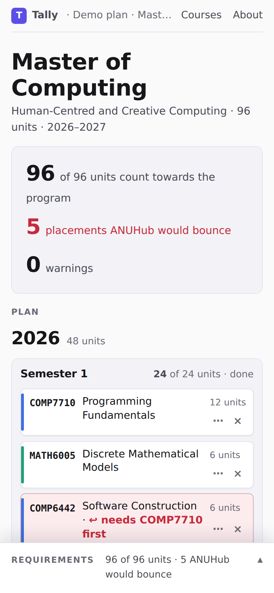

# Process overview

## What I built

Tally, a Master of Computing study planner that says what ANUHub would say
before enrolment day and tallies a plan against the program's requirement
lines. `README.md` says what good means here.

## How I got here

The agent didn't touch the repo until there was a plan and a harness
([`f1cf8a2`](https://github.com/comp4020-agentic-coding-studio/comp4020-crit7-Ray0766/commit/f1cf8a2));
its two rules that mattered most were "never invent a requisite" and "the
planner never refuses a real course".

> 先只出方案和 CLAUDE.md，别动仓库 (plan and CLAUDE.md first; leave the repo alone)

Migration 0001 was checked by booting the built server on a copy of a
database still holding guestbook rows
([`35c1894`](https://github.com/comp4020-agentic-coding-studio/comp4020-crit7-Ray0766/commit/35c1894)).
The transcript of Programs & Courses kept its oddities on purpose — COMP8830
still names COMP8260, COMP8600 is "not checked" — and its test was broken
twice to see it fail on the right line
([`ba3ca3f`](https://github.com/comp4020-agentic-coding-studio/comp4020-crit7-Ray0766/commit/ba3ca3f)).

The planner's contract was committed red before the planner existed
([`c54bb7e`](https://github.com/comp4020-agentic-coding-studio/comp4020-crit7-Ray0766/commit/c54bb7e)),
then met
([`a3b7b75`](https://github.com/comp4020-agentic-coding-studio/comp4020-crit7-Ray0766/commit/a3b7b75)).
Every rule's sentinel was seen red under a deliberate break
([`64e7f93`](https://github.com/comp4020-agentic-coding-studio/comp4020-crit7-Ray0766/commit/64e7f93)).

Two corrections came from looking, not from tests. The demo plan's tally read
90 of 96 and was right: the program takes COMP8715 twice and my unique index
forbade it, so migration 0003 dropped it
([`dc0e222`](https://github.com/comp4020-agentic-coding-studio/comp4020-crit7-Ray0766/commit/dc0e222)).
The first real-browser render showed titles wrapping under the buttons
([`4f956be`](https://github.com/comp4020-agentic-coding-studio/comp4020-crit7-Ray0766/commit/4f956be)),
and axe with layout found 4.26:1 text jsdom had passed
([`9b0e48e`](https://github.com/comp4020-agentic-coding-studio/comp4020-crit7-Ray0766/commit/9b0e48e)).

The first version worked and looked plain, and I said so. The agent opened
Cornell CoursePlan and UNSW Circles in my browser and wrote a brief around the
demo plan's real data; Claude Design drew the sheet; the page was rebuilt after
it — category colours on the cards, short flags with the sentences in a list
below, years as rows
([`aef324b`](https://github.com/comp4020-agentic-coding-studio/comp4020-crit7-Ray0766/commit/aef324b)).

> 我认为这个质量完全不行。你先看看别人好的选课好的 UI 是怎么样的 (this won't do; look at the good planners first)

