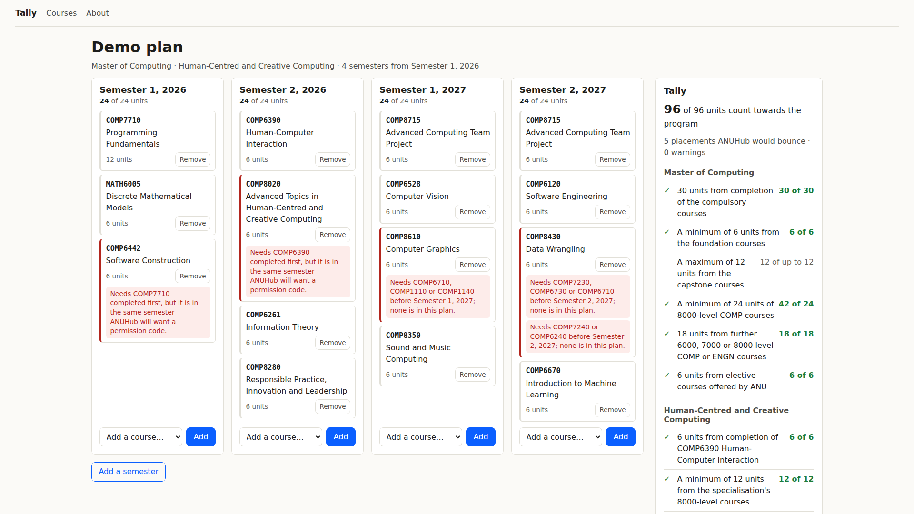

# Tally

A study planner for the ANU Master of Computing. You put courses into
semesters, and the page tells you, before enrolment day, what ANUHub (the
system everyone still calls ISIS) would only tell you when you press enrol —
which requisite isn't met and why, what's incompatible with what, which
semester a course doesn't run in, when a semester is over the full-time load —
and it keeps a running tally of how far the plan is from the 96 units the
program asks for, line by line, the way Programs & Courses states them. A plan
lives at its URL, in SQLite on the machine's volume, so it is still there after
a reload, a restart and a redeploy; open the same URL on a phone and a laptop
and they stay in step.

This is the slice of ANUHub I actually deal with. This semester I am taking
COMP8020, whose requisite is a completed COMP6390, in the same semester as
COMP6390 — the only way through is a permission code, and nothing in ANUHub
shows you that until the moment it refuses you. The program's requirements
live on a different website, and checking a plan against them is done by hand.

## What good looks like here

Good is knowing what ANUHub will say before it says it, and knowing whether
the plan adds up to a degree. Two decisions follow from that.

The planner never refuses a real course. ANUHub refuses; this app records the
placement and says what ANUHub would say and why — "needs COMP7710 completed
first, but it is in the same semester" — because seeing the consequence is the
point. The only refusals are bad data: a code not in the catalogue, a semester
the plan doesn't cover.

The data is a transcript, not an approximation. Every program line, course,
requisite and offering was read from its 2026 Programs & Courses page, and the
[course list](/courses/) links each one. Where the page's requisite has a shape
the planner's model can't carry (COMP8600), the course says "not checked"
rather than passing. Where the page is odd, the planner is odd with it:
COMP8830 still asks for COMP8260, which COMP8280 replaced, so a Master of
Computing plan can never satisfy that line as written — which is true.

Two assumptions are stated on the page: a course's offering pattern is 2026's
and is assumed to repeat, and requisites about which program you are in are
taken as met, because every plan here is a Master of Computing plan.

What is enforced, in `spec/`: a plan persists across a reload; a real course is
never refused; every rule (requisite order, the concurrent case, incompatibility,
offerings, load, each kind of requirement line) has a test that was seen red
first; the transcript's shape and arithmetic; the live stream. What is a
judgement call: whether the flags read as a person would say them, whether the
tally is legible at a glance, and how the semesters stack on a phone — those were
settled in a real browser at both marking viewports, not by the tests.

## What isn't here

One program and one specialisation (Human-Centred and Creative Computing);
the schema has room for more, the transcript doesn't. No login: a plan's URL is
its only key. No tutorial slots, no Summer or Winter sessions, no permission-code
workflow. COMP8715 can be placed twice, but the planner doesn't check that the
two semesters are consecutive.

